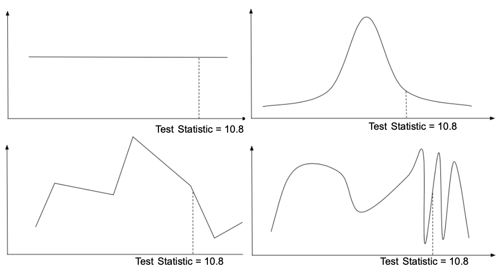
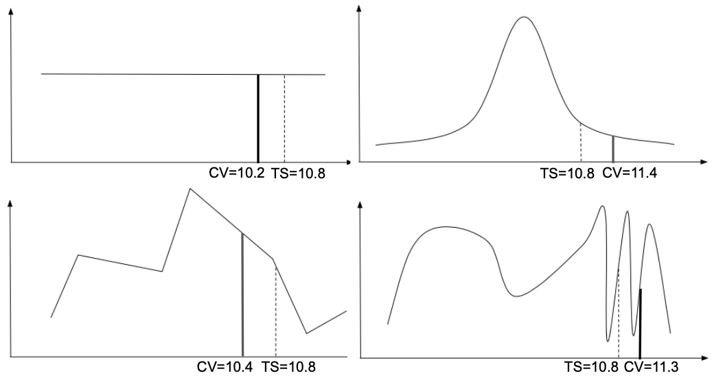
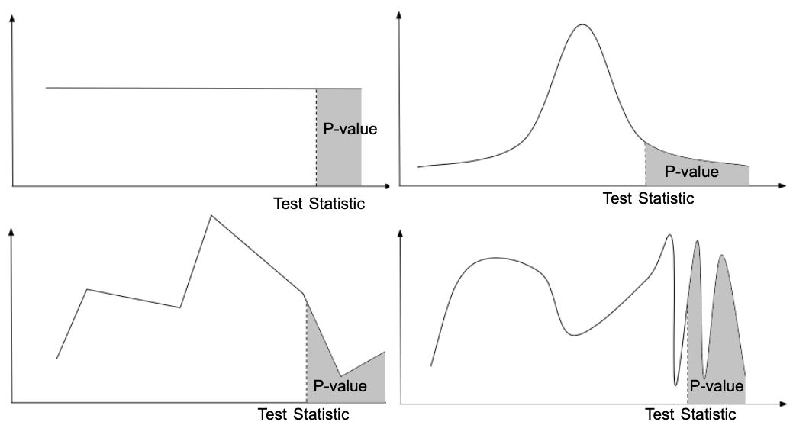
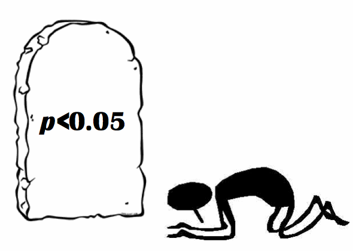

BENG 183 Final Paper  
Group 5: Arzoo Patel, Jason Dai, Yujie Zhang
# Decision-making with a test statistic vs p-value

1. [Introduction](#1)  
2. [Test Statistic](#2)  
    2.1 [What is a test statistic](#21)  
    2.2 [How do you calculate the test statistic](#22)  
    2.3 [Decision-making with a test statistic](#23)  
    2.4 [Example](#24)  
3. [P-value](#3)  
    3.1 [What is a P-value](#31)  
    3.2 [How do you calculate the p-value](#32)  
    3.3 [Decision making with a P-value](#33)  
    3.4 [Example](#34)  
4. [Comparison](#4)
5. [Reference](#5)

## Introduction 

#### Hypothesis testing

A statistical hypothesis is a hypothesis that is testable on the basis of observed data modeled as the realized values taken by a collection of random variables. Hypothesis testing is the use of statistics to determine the probability that a given hypothesis is true.

#### Test statistic decision making

When comes down to the decision making procedure, traditionally test statistic is used. If the test statistic locates within the acceptance region, we accept the null hypothesis. Otherwise, we reject the null hypothesis. 

#### P-value decision making

Another way that is much more popular today is using p-value to make decisions. The common threshold is 0.05. When the p-value is higher than 0.05, we fail to reject the null hypothesis. When the p-value is lower than 0.05, we claim the result to be statitically significant and reject the null hypothesis. 

#### Which one should I use?

Mathematically, p-value decision making and test statistic decision making in the hypothesis testing context are the same. Then why is p-value decision making much more prefered nowadays? Is there a specific reason besides the fact that the simulation of p-value is much easier to conduct in this computing advanced era? We hope you will find an answer as we walk you through the rest of this chapter. Let's start by illustrations of test statistic decision making and p-value decision making. 

## Test Statistic 

### What is a test statistic 

A test statistic is a numerical representation of the similarity or difference between your data and data under a null hypothesis. This number is a random variable where the value fluctuates between different samples and can be mapped to a random probability distribution. 

### How do you calculate the test statistic 

The test statistic can be any arbitrarily-generated, numerical indicator as long as it can measure the similarity of the test data to data under the null hypothesis; however, you typically will want to use an existing statistical test for your experiment such as a t-test, chi-square test, or one of many others. The main reason to use an existing test is because of its proven effectiveness and acceptance in the general scientific community.

Here is a table of many of the popular statistical tests along with their use cases.

<table>
    <tr>
        <th colspan=2><b>Types of Statistical Tests</b></th>
    </tr>
    <tr>
        <td><b>Type of Test</b></td>
        <td><b>Use</b></td>
    </tr>
    <tr>
        <th colspan=2><b>Correlational</b>: these tests look for an association between variables</th>
    </tr>
    <tr>
        <td>Pearson correlation</td>
        <td>Tests for the strength of the association between two continuous variables</td>
    </tr>
    <tr>
        <td>Spearman correlation</td>
        <td>Tests for the strength of the association between two ordinal variables (does not rely on the
        assumption of normal distributed data)</td>
    </tr>
    <tr>
        <td>Chi-square</td>
        <td>Tests for the strength of the association between two categorical variables</td>
    </tr>
    <tr>
        <th colspan=2><b>Comparison of Means</b>: these tests look for the difference between the means of variables</th>
    </tr>
    <tr>
        <td>Paired T-test</td>
        <td>Tests for difference between two related variables</td>
    </tr>
    <tr>
        <td>Independent T-test</td>
        <td>Tests for difference between two independent variables</td>
    </tr>
    <tr>
        <td>ANOVA</td>
        <td>Tests the difference between group means after any other variance in the outcome variable is
        accounted for</td>
    </tr>
    <tr>
        <th colspan=2><b>Regression</b>: these tests assess if change in one variable predicts change in another variable</th>
    </tr>
    <tr>
        <td>Simple regression</td>
        <td>Tests how change in the predictor variable predicts the level of change in the outcome variable</td>
    </tr>
    <tr>
        <td>Multiple regression</td>
        <td>Tests how change in the combination of two or more predictor variables predict the level of
        change in the outcome variable</td>
    </tr>
    <tr>
        <th colspan=2><b>Non-parametric</b>: these tests are used when the data does not meet the assumptions required for parametric tests</th>
    </tr>
    <tr>
        <td>Wilcoxon rank-sum test</td>
        <td>Tests for difference between two independent variables - takes into account magnitude and
        direction of difference</td>
    </tr>
    <tr>
        <td>Wilcoxon sign-rank test</td>
        <td>Tests for difference between two related variables - takes into account magnitude and direction of difference</td>
    </tr>
    <tr>
        <td>Sign test</td>
        <td>Tests if two related variables are different – ignores magnitude of change, only takes into account
        direction</td>
    </tr>
    
</table>
<a href="https://cyfar.org/types-statistical-tests">Source: cyfar.org</a>  

Each of these tests will return a numerical test statistic, which can be used for decision making in the next section.

### Decision-making with a test statistic 
A test statistic can be used to decide the outcome of a hypothesis test. This is done by defining an *acceptance region* delimited by *critical values* and evaluating whether the test statistic falls within the boundaries of this region. Essentially, you can create a test statistic threshold for your hypothesis test and determine whether samples are significantly different or not based on whether they are within the threshold or not.

#### Acceptance region and critical values
The acceptance region is a range of acceptable test statistic values where the null hypothesis gets accepted. This region can be visualized below on the cumulative distribution function or CDF of the test statistic. The critical value is simply the start and end of the acceptance region. So if the acceptance region were between values x and y, x and y would be the critical values. The critical value is also visualized in the diagram below.

*diagram of acceptance region and critical value on normal distribution without values*

Traditionally, the critical values can be found using a lookup table based on the desired significance of the test statistic and the number of degrees of freedom of the hypothesis test. 

For example, the table for a t-test is as follows.

<table>
<tr>
<th><b>Degrees of freedom</th></b>
<th colspan=6><b>Significance</th></b>
</tr>
<tr>
<td></td><td><b>0.90</b></td> <td><b>0.95</b></td> <td><b>0.975</b></td> <td><b>0.99</b></td> <td><b>0.995</b></td> <td><b>0.999</b</td>
</td>
<tr>
<td> 1 </td> <td> 3.078 </td> <td> 6.314 </td> <td> 12.706 </td> <td> 31.821 </td> <td> 63.657 </td> <td> 318.313 </td> 
</tr>
<tr>
<td> 2 </td> <td> 1.886 </td> <td> 2.920 </td> <td> 4.303 </td> <td> 6.965 </td> <td> 9.925 </td> <td> 22.327 </td> 
</tr>
<tr>
<td> 3 </td> <td> 1.638 </td> <td> 2.353 </td> <td> 3.182 </td> <td> 4.541 </td> <td> 5.841 </td> <td> 10.215 </td> 
</tr>
<tr>
<td> 4 </td> <td> 1.533 </td> <td> 2.132 </td> <td> 2.776 </td> <td> 3.747 </td> <td> 4.604 </td> <td> 7.173 </td> 
</tr>
<tr>
<td> 5 </td> <td> 1.476 </td> <td> 2.015 </td> <td> 2.571 </td> <td> 3.365 </td> <td> 4.032 </td> <td> 5.893 </td> 
</tr>
<tr>
<td> 6 </td> <td> 1.440 </td> <td> 1.943 </td> <td> 2.447 </td> <td> 3.143 </td> <td> 3.707 </td> <td> 5.208 </td> 
</tr>
<tr>
<td> 7 </td> <td> 1.415 </td> <td> 1.895 </td> <td> 2.365 </td> <td> 2.998 </td> <td> 3.499 </td> <td> 4.782 </td> 
</tr>
<tr>
<td> 8 </td> <td> 1.397 </td> <td> 1.860 </td> <td> 2.306 </td> <td> 2.896 </td> <td> 3.355 </td> <td> 4.499 </td> 
</tr>
<tr>
<td> 9 </td> <td> 1.383 </td> <td> 1.833 </td> <td> 2.262 </td> <td> 2.821 </td> <td> 3.250 </td> <td> 4.296 </td> 
</tr>
<tr>
<td> 10 </td> <td> 1.372 </td> <td> 1.812 </td> <td> 2.228 </td> <td> 2.764 </td> <td> 3.169 </td> <td> 4.143 </td> 
</tr>
</table>

### Example 
Let’s assume there are on average 100 copies of a certain protein within each cell of a person where the actual numbers follow a normal distribution like this. 

This means if we were to count the number of proteins in say 1000 people, we would observe most of them having around 100 copies of this protein with less people having counts further from the average.
Now let's say we found a patient with 150 copies of this protein in each of their cells.

In this case, our null hypothesis would be that this difference in number of copies is not abnormal and fits in the normal distribution.
A simple test statistic we can use for this problem can just be the number of copies of the protein since this value quantifies how different a particular person's cells are from a cell under the null hypothesis.
Since the test statistic we're using is a value that varies randomly from person to person, it is a random variable, where the distribution of such is modeled by its cumulative distribution function or CDF. 
The CDF is a histogram that shows what percentage of people have a certain count of the protein on the y-axis with the counts on the x-axis.

Now let's try to answer the question of if our patient is abnormal.
The most intuitive way of thinking about it is if we just set a threshold of acceptable counts. So for this example, we might arbitrarily say that if the patient has between 80 and 120 copies of the protein, then they're normal, and anything outside is not. In other words, the acceptance region is bounded by the critical values of 80 and 120.

Since our patient's cells are not within the acceptance region and has a statistic more extreme than the critical values, we don't accept but reject our null hypothesis.

## P-value 

### What is a P-value 

Just like the test statistic, the p-value is a representation of a data point compared to a distribution. In fact, it is only one step further than the test statistic. Using the test statistic and distribution the p-value can be calculated. The p-value is the probability of getting results at least as extreme as the test statistic. In the animation below you can see that the p-value is simply the area under the curve after the test statistic for a one tailed test.

### How do you calculate the p-value 

P-value is calculated by taking the area under the curve of the values more extreme than your test statistic. When the distribution is a well known one the p-value can be calculated by using the distribution's CDF. When a distribution does not have a known CDF the p-value can be calculated through computational simulation. 

### Decision-making with a P-value 

When making a decision with a p-value, scientists use a threshold (&alpha;). &alpha; represents the probability that the results are due to chance. Typical values used for &alpha; include 0.05, 0.01, and 0.001. Once an appropriate &alpha; is chosen and the scientists obtain a p-value, there are two possibilities.  

- If p &geq; &alpha;, then they fail to reject the null hypothesis  

- If p < &alpha;, then they can reject the null hypothesis.

### Example 

Let's use the same example experimentas before but now use p-value to make a decision. Let's set the threshold &alpha; to 0.05.  

A new patient has 175 units of protein. Using the  distribution from before, we can calculate the area under the curve greater 75 units away from 100 (&geq; 175 or &leq; 25) and obtain a p-value of 0.023. Since p < &alpha;, we can reject the null hypothesis and conclude that the patient has an abnormal amount of protein.  

## Comparison 

As you see, both test statistic decision making and p-value decision making make their judgements based on an assumed test distribution. While test statistic is a value on the x axis, p value is an area under the unit curve. 

In the situation with just one variable, If you think test statistic as a point moving along the 1D axis, p-value will be like a curtain you can slide along the 2D wall. The extra dimension p-value brings is the distribution. In test statistic decision making, you need to calculate a critical value which is the boundary between the acceptance region and the rejection region. The area under the curve on the rejection region side of the critical value should be your chosen significance level &alpha;. In other words, given the same &alpha;, test statistic distributions of different shapes give different critical values. 

### Example

Now suppose you are given four different test statistic distributions as the following and you know the test statistic to be 10.8 for each of them.  

Can you draw the conclusion that the hypothesis test decisions made in these cases are of the same confidence level because they have the same test statistic? Apprently no. In fact, the decisions in each case might even be opposite. 

You can see that since the Critical Value (CV) in each case is different, we have case 1 and 3 reject the null hypothesis while case 2 and 4 fail to reject the null hypothesis. But is it possible to compare the confidence level across hypothesis testing cases? The answer is yes. If you calculate the area under the curve with test statistic at least as large as the observed test statistic, you can make the decision by comparing the area with the &alpha; level; you are also able to compare the areas across cases to tell which decision is more confident. Does it remind you anything we covered? Yes, that's exactly what p-value decision making is doing. 

For the same examples, once you know the p-values for each test statistic, you are allowed to compare them and tell which decisions you made are more statistically sounding. 

### Practicality of P-value

P-value, a.k.a. the area under the curve with test statistic at least as extreme as the observed test statistic, is essentially a probability. As a number between 0 and 1, the p-value has the unique comparability across all statistical analysis contexts; the comparability that is itself practical enough to replace test statistic decision making. 

This practicality might not seem obvious. Let me present it in a way much easier to understand. 

Before money was invented, people traded one stuff for another. Person A might use two baskets of fresh fruits to trade for a blanket. Person B might use a rabbit he just hunted to trade for a same blanket. Now if a reasonable person C who has no fruits or rabbits wanted to trade for a same blanket, he would first think what he had and might go ask person A and person B for how much amount did they trade their stuff for the blanket. Then he would think how much a blanket worths his assets and finally went to negotiate and trade. But after money was invented, it gave everything a value. Now if the person C still wanted a blanket, he would just check how much money a blanket costs and go buy it. You see that the time he spent on the trading process was much saved because of the comparability money gave to the products. 

P-value plays a similar role in the hypothesis testing context. Suppose you are doing a literature review for a certain topic and you find several statistical analysis. It's much easier for you to tell which analysis is more statistically significant by comparing the p-values. It wouldn't be that efficient if you only had the test statistic and distributions. Just like money increases the efficiency of trade, the p-value increases the efficiency of scientific studies, in a way you might not notice before.

## Conclusion

As you can see, decision-makings with a test statistic and with a p-value are very similar and can be interchanged; however, due to the many practical benefits of using a p-value, many researchers choose it over a raw test statistic.

## Reference 

- https://previews.123rf.com/images/blamb/blamb1405/blamb140500061/27976819-a-cartoon-arm-wrestling-match-with-the-thin-man-defeating-the-muscular-man-.jpg
- https://encrypted-tbn0.gstatic.com/images?q=tbn:ANd9GcSVyDmLqEit4hu4G4uTjRbmtF3DGV9OXyYwUA&usqp=CAU
- https://cyfar.org/types-statistical-tests